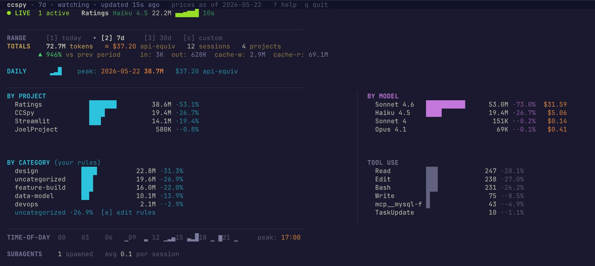

# ccspy — Claude Code Spy

> A local-first terminal dashboard for your Claude Code token usage. See exactly where your tokens go, what it would cost on the pay-as-you-go API, and how you actually work.



**ccspy is read-only — it never touches your Claude Code data.**

---

## Features

- **Live session strip** — shows active sessions as they run, with sparkline and elapsed time
- **Token totals** — headline count with ≈ api-equiv cost, delta vs previous period, and in/out/cache breakdown
- **Daily sparkline** — per-day token volume with peak annotation and cost
- **By project** — horizontal bar chart of token share across your projects, filterable
- **By model** — Sonnet vs Haiku vs Opus split with per-model api-equiv cost
- **By category** — keyword-rule categorisation of sessions (feature-build, debug, design, etc.) — fully customisable
- **Tool use** — which tools Claude called most (Read, Edit, Bash, Write, …)
- **Time-of-day** — 24-bar sparkline in your local timezone, peak hour annotation
- **Timing stats** — avg/median time Claude takes to respond + avg/median time you take to reply
- **Subagent tracking** — spawned subagent count and avg per session
- **Drill-downs** — project → session → turn detail; tool breakdown by project; pricing table; data sources
- **Command palette** (`:`) — fuzzy-search over all actions
- **Export** — dump current view to CSV

All data is read from `~/.claude/projects/**/*.jsonl`. A SQLite cache at `~/.config/ccspy/cache.db` makes subsequent launches instant.

---

## Requirements

- Python 3.11+
- [uv](https://docs.astral.sh/uv/getting-started/installation/) (recommended) or pip
- Claude Code with at least one session in `~/.claude/projects/`

---

## Install

**From GitHub:**

```bash
uv tool install git+https://github.com/erohryan/CCSpy
```

**Clone and install locally:**

```bash
git clone https://github.com/erohryan/CCSpy
cd CCSpy
uv tool install .
```

**With pip:**

```bash
pip install git+https://github.com/erohryan/CCSpy
```

This puts `ccspy` on your PATH.

---

## Usage

```bash
ccspy              # dashboard — 7-day range
ccspy today        # since midnight local time
ccspy week         # last 7 days
ccspy month        # last 30 days

ccspy export --range 30d --format csv --out ~/report.csv
ccspy export --range 7d --format json

ccspy cache rebuild   # re-parse all JSONL files from scratch
ccspy cache clear     # delete the SQLite cache

ccspy --version
ccspy --help
```

---

## Keyboard shortcuts

| Key | Action |
|-----|--------|
| `1` | Today (since midnight) |
| `2` | Last 7 days |
| `3` | Last 30 days |
| `:` | Command palette — fuzzy search all actions |
| `p` | Project picker → drill into sessions |
| `s` | Session picker → drill into turns |
| `t` | Tool picker → drill into per-project usage |
| `e` | Edit category rules in `$EDITOR` |
| `x` | Export current view to CSV |
| `/` | Filter dashboard by project name |
| `r` | Force reload + cache sync |
| `?` | Help overlay |
| `q` / `Ctrl-C` | Quit |

Inside drill-down screens, `Enter` navigates deeper and `Esc` goes back.

---

## Categories

Categories classify your sessions by what you were doing. They're defined in `~/.config/ccspy/categories.toml` as keyword rules — first match wins.

Press `e` in the dashboard to open the file in your `$EDITOR`. Changes take effect immediately on the next reload.

**Default categories:** debug · feature-build · design · planning · refactor · test · review · docs · setup · data-model · performance · security · devops · question

**Example rule:**

```toml
[[rule]]
category = "debug"
match_any = ["fix", "bug", "broken", "error", "crash", "not working"]
```

Matching is case-insensitive substring against the first user message of each session.

---

## Money figures

All dollar amounts are labelled **api-equiv**. If you're on Claude Pro or Max (flat-rate plans), these numbers are *not* your actual bill — they represent what the same token usage would cost on the pay-as-you-go API. Useful for understanding relative cost across projects and models.

Pricing is bundled with the package and updated manually. Run `: → Pricing table` in the command palette to see current rates.

---

## Non-standard data locations

By default ccspy looks for Claude Code data at `~/.claude/projects/`. If yours is elsewhere (WSL, custom install, multiple accounts), set `CLAUDE_HOME`:

```bash
# WSL — Claude Code data is on the Windows side
export CLAUDE_HOME="/mnt/c/Users/yourname/.claude"
ccspy
```

Add it to your shell profile (`~/.zshrc`, `~/.bashrc`) to make it permanent.

---

## Timing data

The TIMINGS row shows:

- **Claude** — how long Claude takes to respond (avg and median across turns)
- **You** — how long you take to reply after Claude finishes

If you see "rebuild cache to populate", run `ccspy cache rebuild` once. This re-parses your JSONL files to capture the user message timestamps needed for timing calculations.

---

## Cache

The SQLite cache at `~/.config/ccspy/cache.db` tracks file mtimes and byte offsets for incremental parsing — only new content is re-read on each sync. The `r` key triggers a sync without a full rebuild.

To start fresh:

```bash
ccspy cache rebuild
```

---

## Data locations

| Purpose | Path |
|---------|------|
| Claude Code transcripts | `~/.claude/projects/**/*.jsonl` |
| ccspy cache | `~/.config/ccspy/cache.db` |
| Category rules | `~/.config/ccspy/categories.toml` |
| Logs | `~/.config/ccspy/ccspy.log` |

ccspy never writes to `~/.claude/`.

---

## License

MIT — see [LICENSE](LICENSE).
